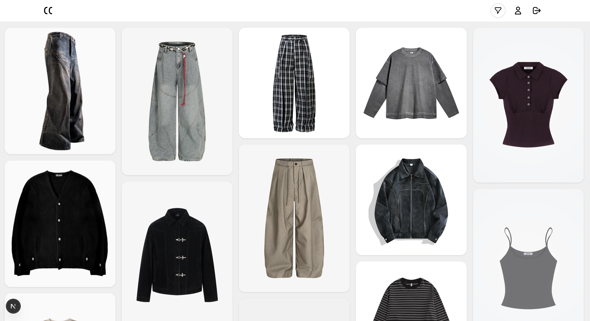
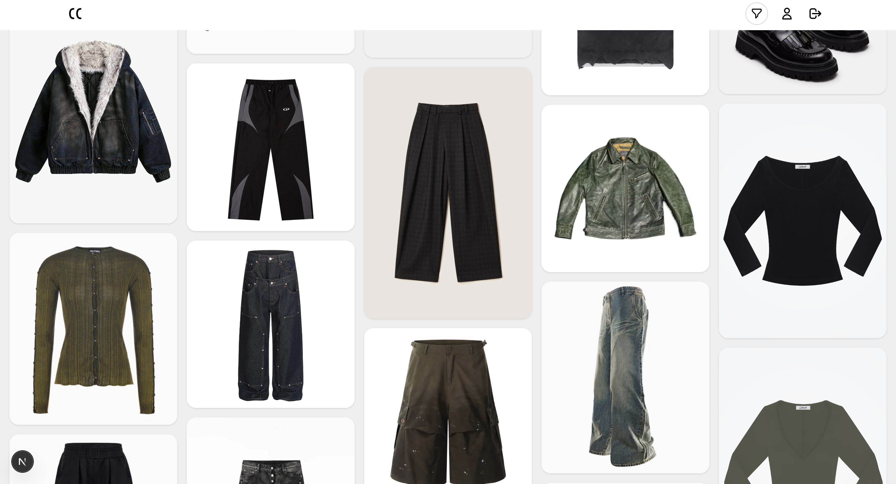
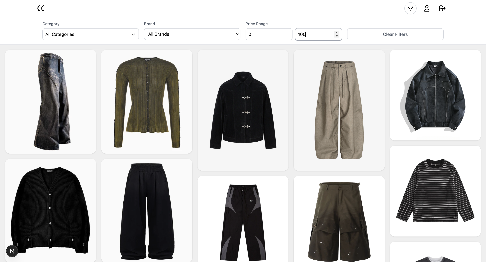
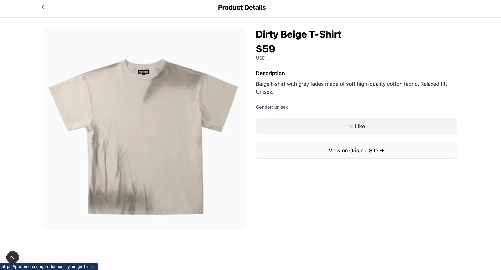
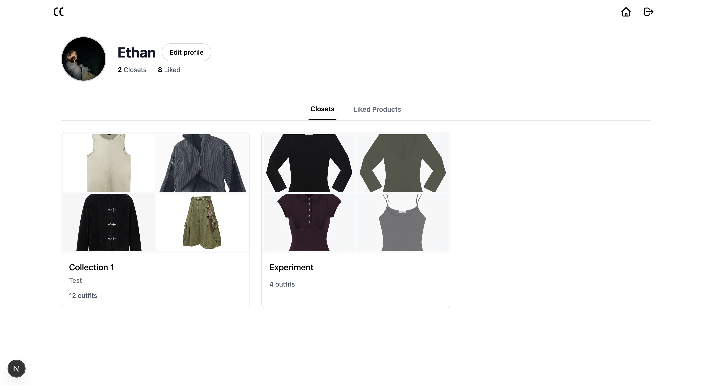
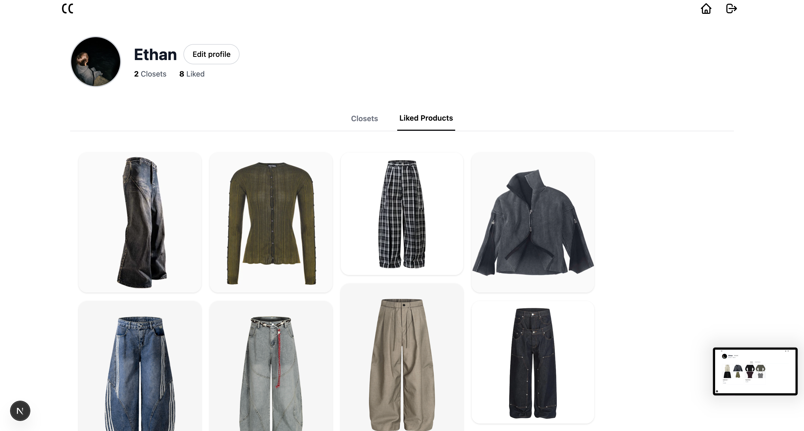
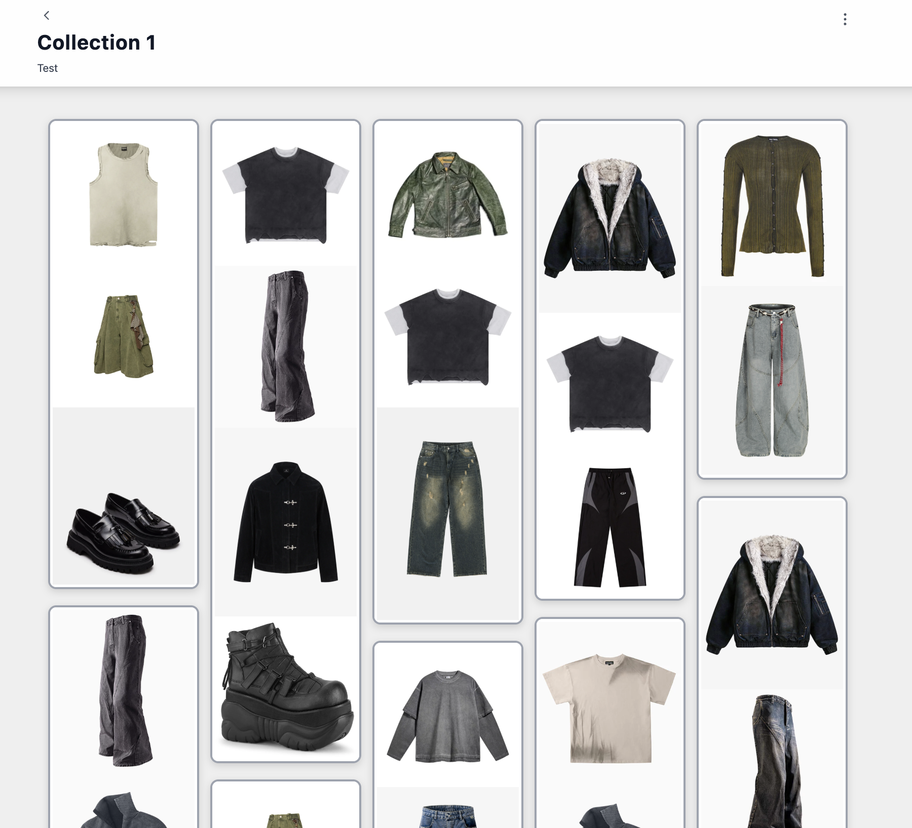

# Couture Closet

A fashion curation and viewing platform that combines the inspiration and mood board aspect of Pinterest with direct brand links for products. Users can discover clothing items, organize them into themed outfits, and save outfits into closets for sharing.

## Project Overview

Couture Closet is a full-stack web application built with Next.js, React, Node.js, and PostgreSQL (via Supabase). It provides a Pinterest-style interface for fashion discovery while maintaining direct connections to retailer product pages.

## Screenshots

### Homepage

The main discovery page features a masonry grid layout with product cards, category filtering, and infinite scroll.





### Category Filter

The category filter allows users to browse by Clothes, Shoes, and Accessories with a clean, minimalist interface.



### Product View

Individual product pages display detailed information including images, price, description, and direct links to retailer pages.



### Account/Profile

The profile page features a Pinterest-style layout with left-aligned profile information and centered tabs for closets and liked products.





### Closet View

Closets display outfit previews in a scrapbook-style layout with drag-and-drop reordering functionality.



## Features

- **User Authentication**: JWT-based auth with Google OAuth support
- **Product Discovery**: Masonry grid layout with category and brand filtering
- **Closet Management**: Create and organize multiple closets
- **Outfit Creation**: Build outfits from products with automatic ordering (Outerwear → Tops → Bottoms → Shoes)
- **Drag-and-Drop**: Reorder outfits within closets
- **Product Liking**: Save favorite products for later
- **Profile Management**: Edit display name, username, and profile picture
- **Direct Retailer Links**: Connect users directly to product pages

## Tech Stack

### Frontend
- Next.js 15.5.2
- React 19
- TypeScript
- Tailwind CSS

### Backend
- Node.js
- Express.js
- Supabase (PostgreSQL)
- JWT Authentication

## Getting Started

### Prerequisites
- Node.js 18+
- npm or pnpm
- Supabase account

### Installation

1. Clone the repository
```bash
git clone <repository-url>
cd "Senior Project"
```

2. Install dependencies
```bash
# Frontend
cd apps/web
npm install

# Backend
cd ../cms
npm install
```

3. Set up environment variables
```bash
# Create .env files in apps/cms/ and apps/web/
# Add your Supabase URL and keys
```

4. Run the development servers
```bash
# Backend (port 3001)
cd apps/cms
npm start

# Frontend (port 3000)
cd apps/web
npm run dev
```

## Project Structure

```
Senior Project/
├── apps/
│   ├── cms/              # Backend API server
│   │   ├── server-REST.js
│   │   ├── add-products-from-urls.js
│   │   └── database/
│   └── web/               # Frontend Next.js app
│       └── src/app/
└── README.md
```

## API Endpoints

See `apps/cms/README.md` for detailed API documentation.

## License

This project is part of a senior capstone project.
